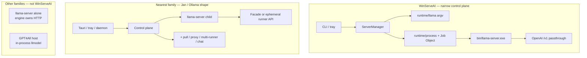

# WinServeAI vs competitor architectures

**Date:** 2026-07-30  
**Branch:** `dev`  
**Confidence rule:** Hard facts = `verified in source` only. Residual uncertainties from the accuracy review stay gaps, not facts.

## Basis

Read-only synthesis from reviewed artifacts (no new upstream research):

| Artifact | Role |
| --- | --- |
| [architecture.md](./architecture.md) | WinServeAI hard rules and layout |
| [audit/completion-audit.md](./audit/completion-audit.md) | MVP implementation vs Windows proof |
| [audit/competitor-accuracy.md](./audit/competitor-accuracy.md) | Accuracy gate + residual uncertainties |
| [research/06-competitor-architecture.md](./research/06-competitor-architecture.md) | Ownership families |
| [research/competitors/STATUS.md](./research/competitors/STATUS.md) | Brief roll-up + gaps |
| [research/competitors/PLAN.md](./research/competitors/PLAN.md) | Confidence vocabulary |
| Five `*.research.md` briefs | Verified claims only (skim) |
| [TODO.md](./TODO.md) / [PLAN.md](./PLAN.md) | Backlog truth (G–I done; A2 proof open) |
| [prior-art.md](./prior-art.md) | Steal/Avoid tone — tables not duplicated here |

Accuracy gate: **PASS for comparison** ([competitor-accuracy.md](./audit/competitor-accuracy.md)).

---

## WinServeAI position

WinServeAI is a **Windows-native llama.cpp appliance wrapper**, not a multi-backend platform and not a chat product.

```text
CLI / tray ──► ServerManager ──► runtime/llama + process ──► bin/llama-server.exe ──► /v1
```

Hard rules (do not violate for competitor parity):

1. One backend: llama.cpp only  
2. One orchestrator: `ServerManager`  
3. Raw llama flags only in `runtime/llama.rs`  
4. YAML config is source of truth  
5. No model downloads, chat UI, Docker, or multi-provider support  

### Architecture families (competitors)

From [06-competitor-architecture.md](./research/06-competitor-architecture.md):

| Family | Products (pinned) | Inference lives where |
| --- | --- | --- |
| **Engine process** | llama.cpp `llama-server` (`b9866`) | Same executable owns HTTP + load + inference (router mode may spawn same-binary children) |
| **Control plane owns children** | Ollama (`v0.32.5`), Jan (`v0.8.4`), LocalAI (`v4.7.1`) | Application control plane supervises separate inference processes |
| **In-process desktop** | GPT4All (`v3.10.0`) | Host loads shared libraries; optional `/v1` is in the same process |

**Nearest family:** control plane owns a `llama-server` child (Jan host → router; Ollama daemon → runner). WinServeAI is that family **narrowed**: one child, one engine, passthrough `/v1`, no registry/proxy/multi-backend.

**Engine relation:** the child *is* the pinned `llama-server` primitive — external system under `bin/`, not our code.

---

## Layout vs nearest family

### Text diagram — WinServeAI vs Jan/Ollama-like control plane

```text
WinServeAI (appliance)                    Jan / Ollama (control plane, same family)
─────────────────────                     ─────────────────────────────────────────
                                          Jan: chat + proxy + multi-provider
                                          Ollama: pull + scheduler + MLX path
CLI / winserve-tray                       Desktop / tray / chat host
        │                                         │
        ▼                                         ▼
  ServerManager  ← sole API                 Plugin / daemon / ModelLoader
        │                                         │
        ├─ runtime/llama (argv only)              ├─ argv / env / YAML→INI / gRPC
        ├─ Job Object KILL_ON_JOB_CLOSE           ├─ kill / PID sweep / Process.Kill
        │                                         │   (no Job Object on llama-server
        │                                         │    path — verified for Ollama/Jan)
        ▼                                         ▼
 bin/llama-server.exe (pinned)            llama-server (or gRPC backend / MLX)
        │                                         │
        ▼                                         ▼
 OpenAI clients ──HTTP──► /v1             clients ──► facade /v1 or /api/*
 (passthrough; no reverse-proxy product)  (Jan proxy; Ollama native+compat; LocalAI gRPC)
```

### Mermaid — ownership comparison



---

## Per-family comparison

| Dimension | WinServeAI | Engine process (`llama-server`) | Control plane (Ollama / Jan / LocalAI) | In-process desktop (GPT4All) |
| --- | --- | --- | --- | --- |
| Product shape | Appliance wrapper | Primitive HTTP engine | Daemon / desktop / Go server over children | Chat app + optional localhost API |
| Who owns inference | `ServerManager` owns one child | Self (single-model); router owns same-binary children | Daemon/host/`ModelLoader` owns children | Host process / shared libs |
| External boundary | `bin/llama-server.exe` | N/A (is the boundary) | Packaged or downloaded runner / gRPC backends | Forked llama.cpp as libraries |
| Backends | llama.cpp only | llama.cpp only | Multi-runner / multi-backend YAML (verified) | Multiple GPU lib variants; still chat-owned |
| API | Passthrough to child `/v1` | Own OpenAI-compatible routes | Facade: Ollama `/api`+`/v1`; Jan proxy; LocalAI HTTP→gRPC | Partial `/v1` embedded in chat process |
| Readiness | Poll `/v1/models`, `/health` fallback | 503 while loading; `/health` + `/v1/models` | Child HTTP health (Ollama); log-line scrape (Jan); gRPC health (LocalAI) | No readiness probe in brief (progress callbacks) |
| Windows orphan policy | Job Object `KILL_ON_JOB_CLOSE` (implemented) | None in `tools/server` | No Job Object on inspected llama-server paths (Ollama/Jan verified); LocalAI absence inferred | N/A — no child inference server |
| Config | YAML source of truth | CLI / env | Env (Ollama); JSON+YAML→INI (Jan); model YAML (LocalAI) | Qt INI |
| Models | Operator local `.gguf` path | CLI / optional HF | Registry pull / hub download / galleries | Gallery + HF discovery |
| Packaging | Inno + stage-release (sources on `dev`) | Zip/tar + Docker images | Inno (Ollama); NSIS/MSI (Jan); Docker-heavy (LocalAI) | Qt IFW |
| Fit for WinServeAI | Self | Engine to wrap | Topology to steal narrowly | Opposite ownership |

---

## Adopt / Reject / Defer

Steal/Avoid style matches [prior-art.md](./prior-art.md); tables there are not repeated.

### Adopt (verified, fits appliance)

| Steal | Evidence | WinServeAI mapping |
| --- | --- | --- |
| Treat OpenAI `/v1` as the product surface | llama-server routes + readiness **verified**; Ollama API-first positioning **verified** | Clients hit child `/v1`; `app/src/api/` stays thin helpers |
| Primary readiness via HTTP, not “process started” | llama-server 503/`/health`/`/v1/models` **verified**; Ollama child `/health` poll **verified** | Already: `/v1/models` then `/health` ([architecture.md](./architecture.md)) |
| Pin release binary + sibling DLLs beside exe | llama-server Windows zip membership **verified**; Ollama ships `llama-server.exe` in Inno **verified** | `bin/` pin + stage-release / Inno payload |
| Single resident owner + second-instance refuse | Ollama tray single-instance **verified**; Jan single-instance plugin + router mutex **verified** | Lockfile + named pipe (implemented) |
| Inno Setup packaging family | Ollama `app/ollama.iss` **verified** | `installer/inno/WinServeAI.iss` (authored; ISCC proof open) |
| Localhost-safe API default | llama-server `127.0.0.1:8080` **verified**; GPT4All localhost-only bind **verified**; Ollama default localhost **verified** | Keep loopback defaults; firewall only for non-loopback |
| Bounded stop → force kill | Jan HTTP drain then force-kill deadline **verified**; Ollama kill/reap paths **verified** | Eight-second grace + force kill + Job Object backstop |
| Keep secrets out of argv if ever logging argv | Jan `LLAMA_API_KEY` via env, argv test **verified** | Tiny optional steal if API key ever added to pin — env not argv |
| Real-process API smoke as proof layer | llama-server pytest spawns server **verified**; completion audit P0 A2 | `scripts/smoke-openai.ps1` + Windows GGUF evidence |

### Reject (explicit — unless a tiny verified steal above)

| Reject | Why | Verified contrast |
| --- | --- | --- |
| **Multi-backend traits / plugins** | Hard rule; LocalAI model YAML selects backend families; Jan multi-plugin; Ollama llama-server + MLX | Appliance stays one spawn path |
| **Model marketplace / pull / gallery** | Hard rule; Ollama pull+blobs; Jan HF/CDN; LocalAI galleries; GPT4All gpt4all.io | Operator supplies `.gguf` |
| **Chat-first product** | Hard rule; Jan/GPT4All are chat hosts; GPT4All embeds inference in UI process | Tray/CLI own manager only — no chat |
| **Docker-as-primary** | Hard rule; LocalAI Dockerfiles/workflows **verified**; not WinServeAI’s ship path | Native Windows Inno + staged tree |
| **Auth platforms / cloud identity** | Out of MVP scope ([TODO.md](./TODO.md)); Ollama local API unauthenticated **verified**; optional engine `--api-key` is engine flag territory, not an auth product | No SSO/registry identity layer |
| **Reverse-proxy facade over many providers** | Jan Hyper proxy multiplexes local + remote **verified** | Passthrough to one child `/v1` |
| **Router / multi-model as product requirement** | Jan `--models-preset` router **verified**; llama-server router mode **verified** | Single-model appliance YAML; router is YAGNI |
| **Runtime download of `llama-server` / CUDA packs** | Jan fetches fork releases + cudart **verified** | Fixed `bin/` boundary |
| **In-process engine in the desktop** | GPT4All `llmodel` LoadLibrary **verified** | Always child process + Job Object |
| **Embedding upstream Web UI as product** | llama-server embedded UI default-on **verified** | Prefer `--no-ui` / leave UI disabled at argv layer |

### Defer (YAGNI)

| Item | Why defer | Note |
| --- | --- | --- |
| llama-server router / `--models-preset` | Single GGUF path meets MVP | Min build for presets still **inferred** (STATUS / accuracy gap) |
| NSSM / Windows Service | Tray + Job Object cover MVP ([prior-art.md](./prior-art.md), Phase 5) | Ollama uses systemd docs on Linux, not a Win SCM product |
| Auto-restart / keep-alive scheduler | Ollama keep-alive unload **verified** — convenience, not proof gap | Crash → `Crashed` state is enough for MVP |
| Log-line readiness classifiers | Jan scrapes ready-lines **verified**; we use HTTP probes | Do not switch to log scrape; optional crash-line classifiers later |
| NVML FFI, ARM64 matrix, auth keys, metrics | Backlog non-blocking / Phase 4–5 | Not release-blocking per completion audit |
| Closing competitor containment gaps | Ollama cgroup / parent-death tests; Jan abnormal host death; LocalAI Job Object absence | Accepted **gaps** — do not treat as facts ([competitor-accuracy.md](./audit/competitor-accuracy.md)) |

---

## Release-blocking gaps (not speculative parity)

From [completion-audit.md](./audit/completion-audit.md). G–I implementation is present on `dev`; MVP **release proof** is not. Do not invent competitor feature parity as blockers.

### P0 — MVP proof blockers

1. **A2 Windows + GGUF smoke** — pin `b9866`, real `.gguf`, Ready + `/v1/models` + OpenAI request (`scripts/smoke-openai.ps1`).  
2. **Orphan-free quit** — Ctrl+C and force-kill manager leave no `llama-server.exe` (`start` / `serve` / tray).  
3. **Install → Ready** — ISCC compile, clean install, Browse `.gguf`, Ready; shortcuts + uninstall firewall.

### P1 — Ownership and lifecycle integration

1. Named-pipe attach + second-owner refusal with real processes.  
2. Job Object manager-kill → child exits.  
3. Tray quit while Ready; CLI attach to tray owner.  
4. `ServerManager` lifecycle against controllable/fake backend (missing binary/model, busy port, timeout, crash).

Backlog truth: [TODO.md](./TODO.md) marks G–I complete; A2 remains non-blocking for *build* but is a **release proof** gap per audit verdict and [PLAN.md](./PLAN.md) ship checklist.

**Not release blockers:** multi-backend, chat, pull, Docker, auth platforms, router mode, matching Jan/Ollama test volume.

---

## Prioritized architecture / test roadmap

Tied to [readiness/README.md](./readiness/README.md) modules. Order follows completion-audit evidence map — proof first, packaging next, then lower-risk coverage.

| Priority | Work | Readiness modules | Outcome |
| --- | --- | --- | --- |
| **P0** | A2 Windows + pinned `llama-server` + GGUF | [runtime-llama.md](./readiness/runtime-llama.md), [server-manager.md](./readiness/server-manager.md), [bin.md](./readiness/bin.md), [server-health.md](./readiness/server-health.md) | Proven Ready + OpenAI request |
| **P0** | Orphan-free quit / Job Object after manager death | [runtime-process.md](./readiness/runtime-process.md), [server-manager.md](./readiness/server-manager.md), [ui.md](./readiness/ui.md) | No orphan `llama-server.exe` |
| **P0** | Install → first-run model path → Ready | [installer.md](./readiness/installer.md), [ui.md](./readiness/ui.md) | Clean-machine MVP path |
| **P1** | Resident attach + single-instance E2E | [cli.md](./readiness/cli.md), [server-manager.md](./readiness/server-manager.md) | Real pipe ownership proof |
| **P1** | Tray quit + tray-owned CLI attach | [ui.md](./readiness/ui.md), [cli.md](./readiness/cli.md) | Desktop owner proven |
| **P1** | Manager lifecycle integration tests | [server-manager.md](./readiness/server-manager.md), [server-health.md](./readiness/server-health.md) | Fail paths without real GGUF |
| **P2** | Stage-release asserts; ISCC CI job | [installer.md](./readiness/installer.md) | Packaging automation |
| **P3** | CLI exit codes, `api` helpers, PS1 Pester, DXGI known-GPU | [cli.md](./readiness/cli.md), [api.md](./readiness/api.md), [scripts-ops.md](./readiness/scripts-ops.md), [system.md](./readiness/system.md) | Coverage depth |

Architecture posture while closing gaps: keep the appliance boundary; do not widen toward control-plane product features rejected above. Optional tiny steals (env for secrets, HTTP drain before kill, localhost defaults) stay inside existing modules.

Project maturity is **3.5/5** (`mvp-partial`) after packaging CI; P0 Windows proof (A2 / install→Ready) still blocks release.

---

## Residual uncertainties (gaps, not facts)

Accepted from [competitor-accuracy.md](./audit/competitor-accuracy.md) / [STATUS.md](./research/competitors/STATUS.md):

1. Ollama: repository-wide Job Object/cgroup on llama-server runner path; abnormal parent-death reclamation tests.  
2. Jan: minimum `llama-server` build for `--models-preset`; abnormal Tauri-host death beyond PID sweep.  
3. LocalAI: platform process-manager Job Object/cgroup absence; machine-wide launcher singleton outside cited path.  
4. GPT4All: no readiness probe in brief; embedded API pytest is Unix-gated (no Windows evidence).

---

## Sources / See also

### Internal

- [architecture.md](./architecture.md) — appliance rules  
- [prior-art.md](./prior-art.md) — Steal/Avoid research notes (do not duplicate tables)  
- [research/06-competitor-architecture.md](./research/06-competitor-architecture.md) — family synthesis  
- [research/competitors/PLAN.md](./research/competitors/PLAN.md) · [STATUS.md](./research/competitors/STATUS.md)  
- Briefs: [ollama](./research/competitors/ollama.research.md) · [jan](./research/competitors/jan.research.md) · [llama-cpp-server](./research/competitors/llama-cpp-server.research.md) · [localai](./research/competitors/localai.research.md) · [gpt4all](./research/competitors/gpt4all.research.md)  
- [audit/competitor-accuracy.md](./audit/competitor-accuracy.md) · [audit/completion-audit.md](./audit/completion-audit.md)  
- [TODO.md](./TODO.md) · [PLAN.md](./PLAN.md) · [readiness/README.md](./readiness/README.md)  
- [adr/0001-appliance-architecture.md](./adr/0001-appliance-architecture.md) · [vision.md](./vision.md)  
- Process / readiness deep dives: [research/01](./research/01-windows-process.md) · [02](./research/02-llama-readiness.md) · [05](./research/05-server-manager.md)

### Upstream pins (via briefs only)

| Product | Pin |
| --- | --- |
| llama.cpp server | `b9866` / `75a48a90559abf65df3f3616a53bb16e5afb9d07` |
| Ollama | `v0.32.5` / `eec8e0b9458b8a01be0c216a9cc53eefde24ef50` |
| Jan | `v0.8.4` / `5f30aee467f08941964a83f946e2663e7ae0e01f` |
| LocalAI | `v4.7.1` / `b224c96db6f4b87306a33a808650bfce63b12588` |
| GPT4All | `v3.10.0` / `228d5379cfb54e966449e153082c74c66b27c6c9` |

Canonical URL index: [policies/SOURCES.md](./policies/SOURCES.md).
