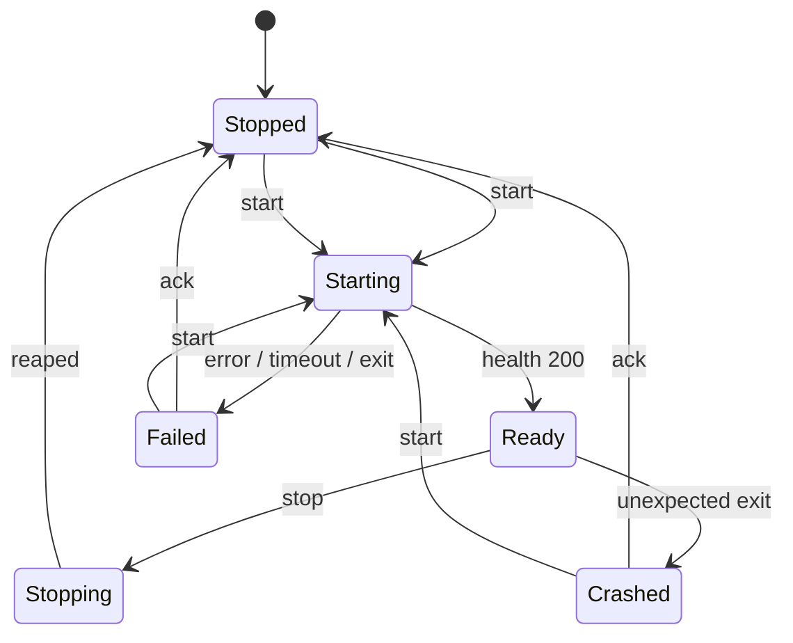

# Server Manager State Machine

Research note: lifecycle ownership and UI boundary for `packages/launcher` (Server Manager). No production code — decisions only.

**Internal:** [architecture.md](../architecture.md), [prior-art.md](../prior-art.md), [backend.md](../backend.md), [api.md](../api.md), [apps/desktop/README.md](../../apps/desktop/README.md)

**Scaffold today:** `ServerManager` exposes `start` / `stop` / `status` / `health` / `metrics` / `version` / config / hardware / endpoint (`packages/launcher`). `ServerState` in `packages/shared` is `Stopped | Starting | Running | Stopping | Unhealthy | Crashed` — **align to Ready / Failed** below (drop `Running` / `Unhealthy` as primary states). `LlamaBackend::start` currently flips `Starting → Running` on spawn alone; readiness must stay in Starting until `GET /health` is 200.

---

## Recommended states and transitions

Canonical MVP machine (matches [prior-art P1](../prior-art.md)):

```text
Stopped ──start──► Starting ──health 200──► Ready
                      │
                      ├── spawn/load/timeout/exit ──► Failed
                      │
Ready ──stop──► Stopping ──reaped──► Stopped
Ready ──unexpected exit──► Crashed
Failed ──ack / stop / idle──► Stopped
Crashed ──ack / stop──► Stopped
Failed|Crashed|Stopped ──start──► Starting   (retry)
```

| State | Meaning | Process | HTTP readiness |
| --- | --- | --- | --- |
| **Stopped** | Idle; no child | none | n/a |
| **Starting** | Spawn + model load in progress | alive or spawning | refuse / **503** / not yet listening |
| **Ready** | Accepting inference | alive | **200** on `/health` |
| **Failed** | Start did not complete (config, binary, model path, bind, readiness timeout, exit code 1 on load) | none (or already dead) | n/a |
| **Stopping** | Graceful stop in flight | dying | ignore probes |
| **Crashed** | Unexpected exit **after** Ready | none | n/a |

**Rules**

1. **Process alive ≠ Ready.** Steal llama-server semantics: [503 while loading, 200 when ok](https://github.com/ggml-org/llama.cpp/blob/master/tools/server/README.md); failed load → exit 1 ([PR #9056](https://github.com/ggml-org/llama.cpp/pull/9056)). Under load, health can stall ([#20684](https://github.com/ggml-org/llama.cpp/issues/20684)) — use generous timeouts; optional PID+port liveness is *not* Ready.
2. **Failed vs Crashed.** Failed = start path never reached Ready. Crashed = was Ready, then child died. Both are terminal until user/CLI starts again (or explicit ack → Stopped). Optional auto-restart is config-owned, default **off** ([prior-art](../prior-art.md)).
3. **Idempotency.** `stop` on Stopped/Failed/Crashed → Stopped (no error). `start` while Starting/Stopping/Ready → reject (`already starting` / `already running` / `busy`).
4. **Single owner.** Only Server Manager mutates state; `packages/process` reports exit codes; backend maps config → argv and probes health; UI only observes.

**Prior-art mapping (steal / avoid)**

| Source | Steal | Avoid for MVP |
| --- | --- | --- |
| **Ollama daemon** — [serve loop](https://github.com/ollama/ollama/blob/main/app/server/server.go), [FAQ](https://docs.ollama.com/faq) | Thin clients (`ollama run` / tray) talk to one daemon; daemon owns spawn, PID file, restart-on-conflict, cleanup of previous instance. Desktop embeds/manages serve — UI is not the process owner. | Model pull/registry; multi-runner scheduler; auto-restart as default product behavior ([#690](https://github.com/ollama/ollama/issues/690) shows restart surprises). |
| **localmodelrouter** — [g023/localmodelrouter](https://github.com/g023/localmodelrouter/) `process.py` | Dedicated ProcessManager: launch, health monitor, graceful shutdown of all children; API layer never spawns. | On-demand multi-model, HF download, VRAM LRU eviction, Ollama protocol translation. |
| **llama-cpp-windows-manager** — [alekk89/llama-cpp-windows-manager](https://github.com/alekk89/llama-cpp-windows-manager) | Supervised `llama-server` sessions; UI shows state/logs/endpoint; manager owns start/stop. | Multi-session gateway, runtime download UI, WSL path, per-model port zoo. |
| **Jan / Tauri** — [router mode](https://github.com/janhq/jan/commit/37f5ab630529d2cd05d180815852fce3a08cc655), [CLI shares core](https://github.com/janhq/jan/issues/7575) | Lifecycle in Rust plugin/core, not webview; CLI and desktop share same start/stop/readiness; unload-then-kill on stop (Windows force-kill needs explicit cleanup). Prefer **managed `Command` + Job Object**, not Tauri sidecar for inference ([prior-art](../prior-art.md), [dormouse/process-wrap](https://github.com/diffplug/mouseterm/pull/41)). | Chat/extensions; AGPL fork risk; historical Cortex-as-sidecar (Jan moved toward router HTTP). |
| **OpenCode / CodeNomad Job Objects** | [OpenCode JobObject](https://github.com/anomalyco/opencode/commit/ddd9c71cca1f30a8214174fc10975e2ff3bb4635), [CodeNomad](https://github.com/NeuralNomadsAI/CodeNomad/commit/1ce58b9dd914e78728eabf40b5fcc645e885300f): `KILL_ON_JOB_CLOSE` so force-kill of manager reaps `llama-server`. | Hand-rolled Win32 when [`process-wrap`](https://docs.rs/process-wrap) suffices. |



---

## Public API surface (what desktop/CLI may call)

All entry points go through **`winserve-launcher::ServerManager`** (or a thin Tauri command / CLI wrapper that holds one `ServerManager`). Never call `Backend` or `ManagedProcess` from UI code.

| Call | Role | Notes |
| --- | --- | --- |
| `start()` | Transition Stopped/Failed/Crashed → Starting → Ready\|Failed | Blocks or returns immediately + events; either way, **state is authoritative**. |
| `stop()` | Ready\|Starting\|Crashed\|Failed → Stopping → Stopped | Graceful then kill job; idempotent. |
| `status() → ServerState` | Snapshot for tray/CLI | Poll or subscribe. |
| `health() → HealthStatus` | `{ healthy, state, message? }` | Manager-owned probe; UI displays, does not implement readiness loop. |
| `endpoint()` | `host:port` for clients | From config; display “OpenAI base URL”. |
| `config()` / `update_config(Config)` | Read/write YAML-backed settings | Validate; reject update while Starting/Ready/Stopping (or require stop first). |
| `hardware()` | Inventory snapshot | Display-only; no layer math in UI. |
| `metrics()` / `version()` | Optional status chrome | Metrics stay minimal until Phase 5. |

**Subscribe (implement when desktop lands)**

- State change stream: `ServerState` + optional last error string.
- Log lines: forwarded from `packages/logging` / process stdout-stderr (UI is a viewer).

**Not public (internal to launcher → backend → process)**

- `Backend::{initialize, load_model, start, stop, …}`
- Argv / llama flags (`LlamaBackend::build_args`)
- Job Object / PID / `taskkill`
- Direct HTTP to `/health` for *ownership* of readiness (manager only)

**Tauri shape (Phase 2):** Rust commands invoke `ServerManager`; webview never uses `@tauri-apps/plugin-shell` or sidecar for `llama-server`. Bundle binary beside install dir; resolve path in launcher/llama, not frontend.

---

## What UI must never do

1. **Spawn or kill `llama-server`** (or any backend binary) — including via Tauri sidecar, `Command`, or PowerShell.
2. **Know backend-specific flags** (`-ngl`, `--fit`, `--ctx-size`, …) or import `winserve-llama`.
3. **Own readiness** — no UI-side “poll `/health` then mark green” as source of truth; call `status`/`health` on the manager.
4. **Own crash recovery** — no UI auto-restart loops; optional restart policy lives in manager + config.
5. **Bypass config** — no ad-hoc model path / port only in UI memory; persist through `update_config` / YAML.
6. **Treat process start as Ready** — show Starting until manager reports Ready (or Failed).
7. **Chat, downloads, HF, multi-session gateways** — out of MVP ([AGENTS.md](../../AGENTS.md)).

Desktop responsibilities only ([apps/desktop/README.md](../../apps/desktop/README.md)): edit config, display logs, display state, start, stop. On quit: `stop()`; Job Object is the backstop if force-killed.

---

## Links

| Topic | Link |
| --- | --- |
| Architecture layering | [docs/architecture.md](../architecture.md) |
| Prior art (Job Objects, readiness, P1 launcher) | [docs/prior-art.md](../prior-art.md) |
| Backend trait | [docs/backend.md](../backend.md), `packages/backend` |
| Shared states (to realign) | `packages/shared` `ServerState` |
| Server Manager scaffold | `packages/launcher` |
| Process scaffold | `packages/process` |
| llama-server `/health` | [tools/server README](https://github.com/ggml-org/llama.cpp/blob/master/tools/server/README.md) |
| Health ≠ slots free | [llama.cpp#9056](https://github.com/ggml-org/llama.cpp/pull/9056) |
| Health under load | [llama.cpp#20684](https://github.com/ggml-org/llama.cpp/issues/20684) |
| Ollama serve / PID cleanup | [app/server/server.go](https://github.com/ollama/ollama/blob/main/app/server/server.go) |
| localmodelrouter ProcessManager | [g023/localmodelrouter](https://github.com/g023/localmodelrouter/) |
| Windows manager (supervised sessions) | [alekk89/llama-cpp-windows-manager](https://github.com/alekk89/llama-cpp-windows-manager) |
| Jan router lifecycle (Rust-owned) | [janhq/jan#8130 commit](https://github.com/janhq/jan/commit/37f5ab630529d2cd05d180815852fce3a08cc655) |
| Tauri Job Object patterns | [OpenCode](https://github.com/anomalyco/opencode/commit/ddd9c71cca1f30a8214174fc10975e2ff3bb4635), [CodeNomad](https://github.com/NeuralNomadsAI/CodeNomad/commit/1ce58b9dd914e78728eabf40b5fcc645e885300f), [process-wrap](https://docs.rs/process-wrap) |
| Readiness mental model (liveness vs ready) | [llm-d readiness-probes](https://github.com/llm-d/llm-d/blob/main/docs/readiness-probes.md) |

---

## Open questions

1. **`start()` sync vs async API** — Block until Ready|Failed (CLI-friendly) vs return on spawn and push state events (tray-friendly)? Prefer one internal implementation + both facades.
2. **Config changes while Ready** — Require stop-then-start, or support hot-reload of non-bind settings only?
3. **Failed/Crashed → Stopped** — Auto-clear on next successful status poll, explicit `reset()`, or leave until `start`/`stop`?
4. **Starting + user Stop** — Cancel in-flight readiness and go Stopping, or ignore stop until Ready|Failed?
5. **Unhealthy overlay** — If process alive but `/health` fails after Ready (load stall [#20684](https://github.com/ggml-org/llama.cpp/issues/20684)), stay Ready with `healthy: false` in `HealthStatus`, or add a transient Unhealthy state? Recommendation: **keep Ready**, surface via `health().healthy`.
6. **Port conflict / stale process** — Adopt Ollama-style reap-on-conflict once, or fail with a clear message and let the user stop the other instance?
7. **Graceful stop on Windows** — Ctrl+Break vs terminate-after-timeout still open in [prior-art](../prior-art.md); state machine should treat both as Stopping → Stopped.
8. **CLI and tray concurrency** — Single manager process (named pipe / local socket) vs in-process only until Phase 5 management API?

---

*Actionable next steps when implementing: (1) rename `Running`→`Ready`, add `Failed`, demote `Unhealthy` to health flag; (2) hold Starting until `/health` 200; (3) exit watcher → Crashed; (4) Job Object in `packages/process`; (5) Tauri commands only wrap `ServerManager`.*
