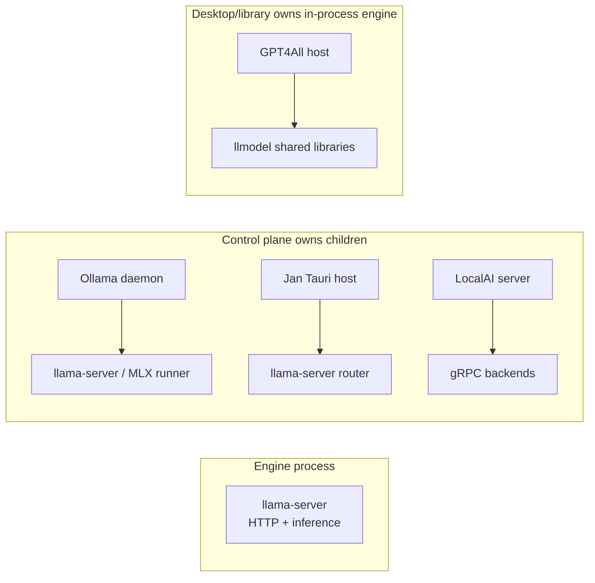
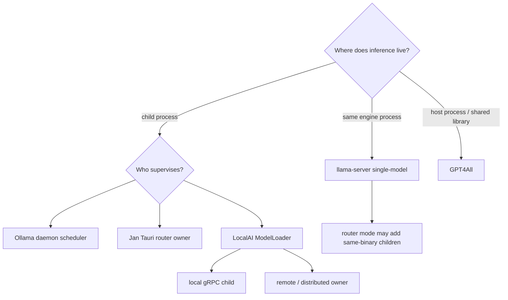

# Competitor architecture synthesis

**Date:** 2026-07-30  
**Basis:** Pinned competitor briefs only. No additional upstream research was performed.

## Confidence and scope

This synthesis uses the research plan's confidence vocabulary:

- **verified in source** — backed by a specific path at the brief's pinned revision.
- **inferred from source** — a reasonable conclusion from inspected code, but not directly established.
- **unverified** — not backed by a source path at the pinned revision.

Only **verified in source** claims are treated as hard facts. Citations point to the pinned briefs rather than introducing new upstream URLs. This document groups competitor architectures; it does not yet compare the complete WinServeAI product against them.

## Architecture families

### 1. Engine process owns HTTP and inference

**llama.cpp `llama-server`** is the primitive server architecture. In single-model mode, one executable owns HTTP, model loading, and inference in-process. In router mode, that same executable becomes a parent that starts child instances of itself. **verified in source** (`competitors/llama-cpp-server.research.md`)

The absence of a product-level desktop supervisor or service manager inside `tools/server` is **inferred from source** in the brief, not a hard fact.

### 2. Control plane owns inference children

**Ollama, Jan, and LocalAI** place an application-owned control plane above separate inference processes, but their ownership boundaries differ:

- **Ollama:** desktop app → daemon → scheduled runner. The GGUF runner is upstream `llama-server`; MLX follows a separate runner path. **verified in source** (`competitors/ollama.research.md`)
- **Jan:** Tauri host → one `llama-server` in router mode. A separate in-process reverse proxy exposes a stable API and can also route to remote providers. **verified in source** (`competitors/jan.research.md`)
- **LocalAI:** optional desktop launcher → Go server → one or more gRPC backend processes, remote backend addresses, or distributed workers. Backend choice comes from model YAML. **verified in source** (`competitors/localai.research.md`)

The shared family trait is process separation. It does **not** imply equivalent containment: the briefs do not establish a Job Object on any of these three inference-child paths. Ollama's runner path and Jan's router path are specifically documented without one; LocalAI's absence claim is only **inferred from source** from the inspected ownership files. Scope matters for Ollama: it does use `JOB_OBJECT_LIMIT_KILL_ON_JOB_CLOSE`, but only for agent shell-tool children, never for `llama-server`. **verified in source**

### 3. Desktop process owns inference in-process

**GPT4All** loads backend shared libraries into the desktop, Python, or Node host process. The Qt desktop's optional HTTP server is another object in that same process, not a daemon supervising a child inference server. **verified in source** (`competitors/gpt4all.research.md`)



## Product architectures

### llama.cpp `llama-server`

Pinned at `b9866` (`75a48a90559abf65df3f3616a53bb16e5afb9d07`). **verified in source**

```text
OpenAI / Anthropic / legacy clients
                    │ HTTP, default 127.0.0.1:8080
                    ▼
┌──────────────────────────────────────────────────────────┐
│ llama-server                                             │
│  cpp-httplib routes + optional embedded Web UI           │
│  single-model: libllama + GGUF inference in-process      │
│  router mode: server_models                              │
└──────────────────────────┬───────────────────────────────┘
                           │ router mode only
                           ▼
                    child llama-server instances
```

- **Ownership:** no parent supervisor in single-model mode; router mode owns same-binary children. No Job Object, cgroup, or source-enforced singleton was found in the scoped server code. **verified in source**
- **API/lifecycle:** HTTP starts before model loading; non-ready requests receive 503, `/health` returns 200 when ready, failed model load exits 1, and signal handling stops the loop. There is no built-in crash restart. **verified in source**
- **Configuration/storage:** CLI and environment variables; local GGUF or optional Hugging Face paths/downloads; optional router INI presets. **verified in source**
- **Packaging:** platform zip/tar artifacts and Docker images; the inspected Windows zip includes the executable and sibling DLLs rather than an installer. **verified in source**
- **Tests:** pytest starts real server processes and tests health, auth, OpenAI routes, router behavior, and other API behavior. It does not prove external supervisor ownership. **verified in source**
- The statement that `tools/server` has no native desktop/tray product is **inferred from source**, not promoted to a hard fact here.

Source: `competitors/llama-cpp-server.research.md`.

### Ollama

Pinned at `v0.32.5` (`eec8e0b9458b8a01be0c216a9cc53eefde24ef50`). **verified in source**

```text
Desktop tray app
      │ spawns, monitors, restarts
      ▼
ollama serve  :11434
      │ Scheduler
      ├──────────────► llama-server on ephemeral HTTP port (GGUF)
      └──────────────► ollama runner --mlx-engine (MLX)

CLI / OpenAI clients ──HTTP──► ollama serve
Models: ~/.ollama/models/{manifests,blobs}
```

- **Ownership:** nested supervision. The tray app owns the daemon; the daemon scheduler owns runner children. Runner stop uses `Process.Kill`; Windows daemon cleanup also uses console events and `taskkill /T`. The brief verifies no Job Object on the `llama-server` path. **verified in source**
- **API/lifecycle:** native `/api/*`, OpenAI-compatible `/v1/*`, and Anthropic-compatible routes share one daemon. The scheduler performs on-demand load, keep-alive expiry, unload, and child health polling. The desktop restarts a failed daemon. **verified in source**
- **Configuration/storage:** environment-driven configuration, registry pulls, manifests, and content-addressed blobs. **verified in source**
- **Packaging:** Windows Inno Setup ships `llama-server.exe`; macOS DMG, Linux archives/install script, systemd guidance, and Docker are also represented. **verified in source**
- **Tests:** broad Go unit tests plus build-tagged integration tests and CI across runner presets. The claim that these tests do not prove Job Object ownership is **inferred from source**.
- No cgroup ownership API was observed, but that statement remains **unverified** in the brief and is not used as a hard conclusion.

Source: `competitors/ollama.research.md`.

### Jan

Pinned at `v0.8.4` (`5f30aee467f08941964a83f946e2663e7ae0e01f`). **verified in source**

```text
OpenAI clients ──► Jan API server 127.0.0.1:1337 /v1
                         │ reverse proxy, inside the Tauri host process
                         ├────────────► remote providers
                         ▼
┌──────────────────────────────────────────────────────────┐
│ Tauri host + React webview                              │
│  tauri-plugin-llamacpp                                  │
│  one guarded RouterHandle                              │
└──────────────────────────┬───────────────────────────────┘
                           │ spawn
                           ▼
llama-server router 127.0.0.1:<random>
  --models-preset router.preset.ini --models-max N
  models loaded/unloaded over HTTP
```

- **Ownership:** the Tauri host directly owns one router child. Windows uses `CREATE_NO_WINDOW | CREATE_NEW_PROCESS_GROUP`, `kill_on_drop`, and a direct-child PID sweep, but no Job Object. Windows stop force-kills after an HTTP-mediated model drain; Unix uses SIGTERM then SIGKILL. **verified in source**
- **API/lifecycle:** readiness and crash classification scrape child output. The outer Hyper server is a reverse proxy/multiplexer; the inner router is the inference API. Single-instance guards exist for the desktop, proxy, and router handle. **verified in source**
- **Configuration/storage:** app settings are JSON, per-model definitions are YAML compiled to router INI, and backend binaries plus CUDA runtime packages are downloaded at runtime. **verified in source**
- **Packaging:** Tauri NSIS/MSI on Windows, platform-specific packages elsewhere, and a portable workflow. The inference binary is not bundled in the installer. **verified in source**
- **Tests:** extensive Rust and TypeScript tests, coverage CI, Playwright, and AutoQA. Router tests pin argv, secret placement, readiness strings, and crash classification. Abnormal parent-death reclamation is not established by a test. **inferred from source**
- The exact minimum upstream build supporting router presets was not found. That compatibility floor remains **inferred from source** and is a gap.

Source: `competitors/jan.research.md`.

### LocalAI

Pinned at `v4.7.1` (`b224c96db6f4b87306a33a808650bfce63b12588`). **verified in source**

```text
Optional Fyne launcher/tray
      │ starts
      ▼
local-ai Go server :8080
      │ ModelLoader + model YAML
      ├────────► local backend child ── gRPC ──► inference
      ├────────► external backend gRPC address
      └────────► distributed worker ──► backend child

Clients ──► OpenAI + LocalAI/Ollama/Anthropic/etc. HTTP routes
```

- **Ownership:** for local execution, `ModelLoader` retains process handles, captures output and exit codes, and stops children at application shutdown. Remote and distributed paths move ownership beyond the frontend process. A desktop launcher may add another parent above the server. **verified in source**
- **API/lifecycle:** model loads start a backend, poll gRPC health, then call `LoadModel`. Watchdogs evict on idle, busy timeout, LRU, or memory pressure. Exit handlers stop tracked backends, but the observed exit watcher does not itself restart them. **verified in source**
- **Configuration/storage:** model YAML selects among many backend families. Models, data, configuration, and backend artifacts have separate paths; gallery and downloader services install artifacts from multiple URI schemes. **verified in source**
- **Packaging:** native server binaries, macOS/Linux launcher artifacts, and accelerator-specific Docker builds. Windows native release targets are commented out at the pin. **verified in source**
- **Tests:** mock-backed HTTP tests, direct gRPC backend contract tests, watchdog/lifecycle tests, launcher tests, integration, distributed, and e2e suites. The launcher tests do not prove the complete launcher → server → inference-child chain. **verified in source**
- The absence of Job Object/cgroup attachment and machine-wide launcher singleton is **inferred from source** in the brief, so neither is treated as a hard fact.

Source: `competitors/localai.research.md`.

### GPT4All

Pinned at `v3.10.0` (`228d5379cfb54e966449e153082c74c66b27c6c9`). **verified in source**

```text
┌──────────────────────────────────────────────────────────┐
│ gpt4all-chat Qt/QML process                             │
│  SingleApplication                                     │
│  ChatLLM on QThread ──► LLModel in-process              │
│  Server : ChatLLM ──► QHttpServer 127.0.0.1:4891       │
└──────────────────────────┬───────────────────────────────┘
                           │ LoadLibraryExW / dlopen
                           ▼
llmodel backend libraries: CPU | CUDA | Kompute | Metal
                           │
                           ▼
              forked llama.cpp submodule

Python / CLI / TypeScript hosts load the same backend family separately.
```

- **Ownership:** inference belongs to the host process and its threads; there is no external `llama-server` inference child in the inspected desktop/backend paths. The optional HTTP server is embedded in the chat process. **verified in source**
- **API/lifecycle:** localhost-only `/v1` subset, default port 4891, disabled by default via `serverChat`. Disabled handlers return 401; this is a feature gate rather than bearer authentication. Desktop single-instance and explicit chat teardown govern lifecycle. **verified in source**
- **Configuration/storage:** Qt INI settings, a writable model directory, first-party gallery downloads, and Hugging Face discovery. **verified in source**
- **Packaging:** Qt Installer Framework packages plus Python distribution. **verified in source**
- **Tests:** pytest starts the real chat executable and exercises its embedded HTTP API; binding tests cover Python and TypeScript. These do not test child-process containment because the architecture has no child inference server. **verified in source** That pytest harness overrides the Qt INI through XDG config and skips non-Unix and Darwin hosts, so it carries no Windows evidence. **verified in source**
- A historical README Docker API reference does not match the pinned tree and remains **unverified** for this architecture.

Source: `competitors/gpt4all.research.md`.

## Divergent ownership models



The decisive boundary is not GUI versus CLI. It is whether the engine is:

1. the server process itself (`llama-server`);
2. a child behind an application control plane (Ollama, Jan, LocalAI local mode); or
3. a shared library inside the product host (GPT4All).

That boundary determines which layer can observe exits, restart work, reclaim descendants, and expose readiness. These consequences are **inferred from source** as synthesis; each product's underlying topology is **verified in source**.

## API and lifecycle patterns

- **Direct engine API:** `llama-server` exposes its own OpenAI-compatible routes and readiness. **verified in source**
- **Daemon facade:** Ollama exposes native and compatibility APIs while hiding ephemeral runner APIs. **verified in source**
- **Reverse-proxy facade:** Jan fronts the local router and remote providers with a separate OpenAI-shaped endpoint. **verified in source**
- **Protocol control plane:** LocalAI translates HTTP model requests into a backend gRPC contract. **verified in source**
- **Embedded desktop API:** GPT4All exposes a partial API from the same process that owns the UI and inference. **verified in source**

Readiness likewise varies: HTTP status (`llama-server`, Ollama child health), log-line recognition (Jan), and gRPC health (LocalAI) are each **verified in source**. GPT4All is the exception: its brief records no readiness probe at all — model load reports progress through in-process callbacks — so treating that as a readiness mechanism is **inferred from source**.

Stop behavior ranges from signal-driven engine shutdown, through kill/reap and watchdog policies, to in-process thread/object teardown; Jan's Windows path has no graceful signal stop at all and force-kills after an HTTP drain. Grouping these as one spectrum is **inferred from source** as synthesis, and no common cross-product lifecycle abstraction is evidenced by the briefs.

## Configuration, model storage, and packaging

- `llama-server` is CLI/env-first and distributed as engine artifacts. **verified in source**
- Ollama couples its daemon to a registry-style manifest/blob model store and ships the runner with the app. **verified in source**
- Jan downloads versioned backend packages after installation and compiles per-model YAML into router INI. **verified in source**
- LocalAI uses model YAML to select separately packaged or remote backends and supports artifact galleries. **verified in source**
- GPT4All packages shared backend libraries with a desktop product and manages model downloads in the UI. **verified in source**

Packaging follows ownership. Engine artifacts can remain archives; desktop-owned products use installers; daemon/control-plane products additionally package or fetch child runtimes; distributed control planes emphasize containers and backend bundles. The relationship in this sentence is **inferred from source** from the verified product examples.

## Test-strategy synthesis

The briefs show four recurring test layers:

1. **Pure/unit tests** for argument construction, route translation, settings, scheduling, and classifiers.
2. **Real-process API tests** for `llama-server`, Ollama integration paths (build-tag gated), Jan e2e, and GPT4All's chat executable (Unix-gated harness).
3. **Runtime-boundary tests** for LocalAI's gRPC backend contract and Jan's router argv/readiness behavior.
4. **Packaging/UI tests** through CI matrices, Playwright, launcher tests, or GUI AutoQA.

Ollama and Jan explicitly lack Job Object ownership on the inspected inference paths, and GPT4All does not cross a child-process boundary at all. **verified in source** LocalAI's containment absence is **inferred from source**. The comparative judgment that API correctness is better evidenced across these products than abnormal process-tree reclamation is **inferred from source** as synthesis over the five briefs; no brief states it.

## WinServeAI boundary notes

These are scope markers, not a full comparison:

- WinServeAI's diagram vocabulary treats `ServerManager` as the sole orchestrator and `bin/llama-server.exe` as an external system.
- The closest ownership family is the child-process control-plane family, while the external binary itself is the pinned `llama-server` primitive.
- Multi-backend routing, model marketplaces/downloaders, chat-owned inference, and distributed workers belong to other product boundaries and are not implied requirements.

The full product comparison is intentionally deferred to `docs/comparison.md` after accuracy review.
